# openEuler 基础安装

> ### ⛵ 万事俱备，只欠东风
>
> 经过了上几节的准备工作，我们可以开始正式安装 openEuler 了。如果你还没有完成前面的阅读，请先仔细阅读章节 [安装前的准备](./pre-install.md)。

> ### 🔖 这一节将会讨论：
>
> ::: details 目录
>
> [[toc]]
>
> :::

本节从安装最基础的、无图形化界面的 openEuler 系统开始。

## 1. 进入安装界面

1. 根据前面几节的内容，我们应该可以进入到如下的安装界面了：

   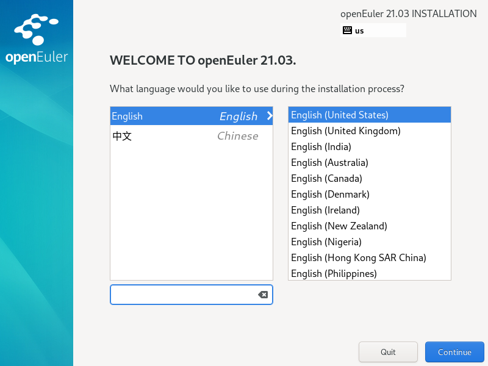

2. 选择语言 `中文` > 点击 `继续`：

   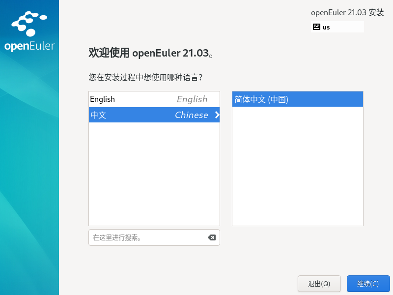

## 2. 配置安装选项

此时将可以看到如下安装设置主界面：

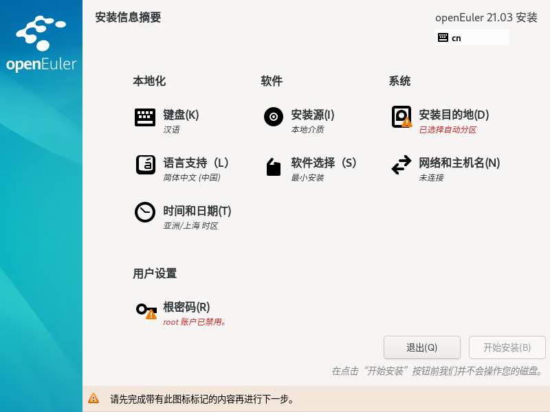

可以在此进行时间、语言、安装源、网络、安装位置等相关设置。

部分配置项会有告警符号（⚠️），完成该选项配置后，告警符号消失。当界面上不存在告警符号时才能单击 `开始安装` 进行系统安装。

### 2-1. 配置安装位置

1. 点击 `安装目的地`：

   

2. 选择需要安装 openEuler 的相关磁盘 > 将 `储存配置` 改为 `自定义`：

   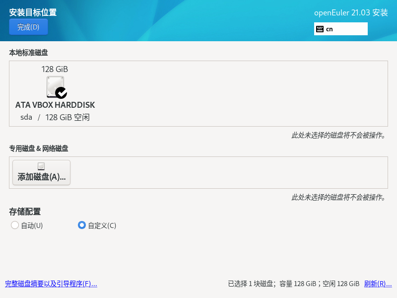

3. 点击 `完成` 以继续：

   

4. 将分区方案从 `LVM` 更改为 `标准分区`：

   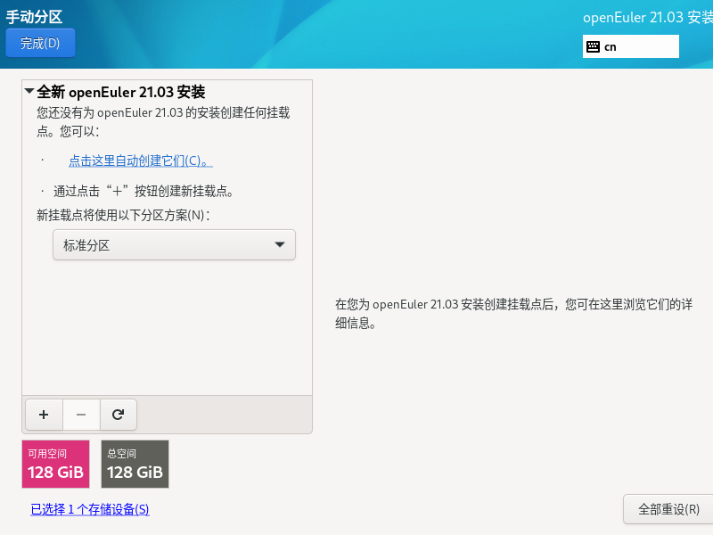

5. 点击 `+` > `挂载点` 选择 `/boot` > `期望容量` 填入 `1024MiB` > 点击 `添加挂载点`：

   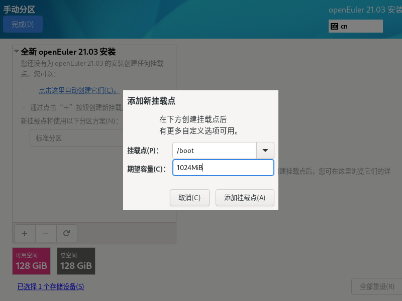

6. 同理，依次完成以下分区的创建：

   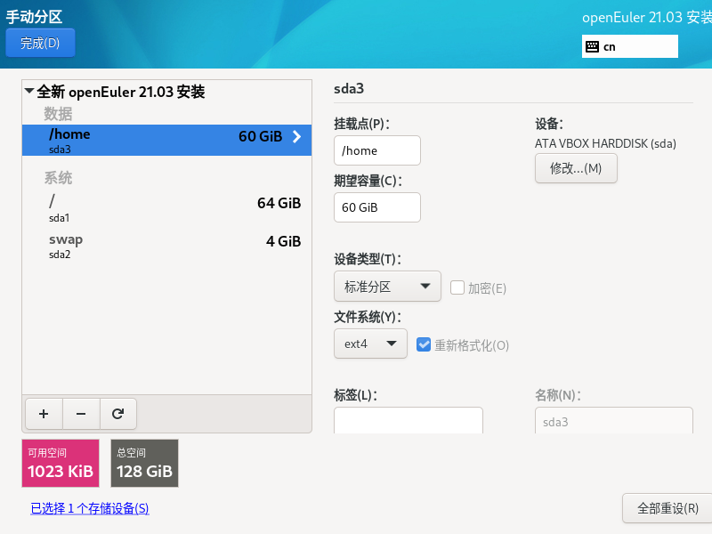

   1. swap 分区
      - 挂载点 —— `swap`
      - 期望容量 —— `>= 4GiB`

   ::: tip ℹ️ 提示

   请**不要**按照 [openEuler Doc](https://docs.openeuler.org/zh/docs/21.03/docs/Installation/%E5%AE%89%E8%A3%85%E6%8C%87%E5%AF%BC.html) 的说明不创建 swap 分区，因为 [交换区是允许公平地回收内存的有用工具](https://farseerfc.me/zhs/in-defence-of-swap.html)。

   :::

   2. 根目录分区
      - 挂载点 —— `/`
      - 期望容量 —— `>= 64GiB`

   ::: tip ℹ️ 提示

   若不输如期望容量，默认将是剩余的全部容量

   :::

   3. 家目录分区
      - 挂载点 —— `/home`
      - 期望容量 —— `剩余全部容量且 >= 64GiB`

   ::: tip ℹ️ 提示

   若磁盘空间小于等于 `128GiB`，则建议不用单独为家目录创建分区。

   :::

   4. esp 分区
      - 挂载点 —— `/boot/efi`
      - 期望容量 —— `>= 1GiB`

   ::: tip ℹ️ 提示

   只有使用 GPT + UEFI 模式（而非传统的 Legacy + MBR 模式）才需要创建 esp 分区。

   :::

   ::: tip ℹ️ 提示

   可根据实际情况自行创建其它分区，本指南不再赘述。

   若需要创建不在列表选择内的挂载点，需要在右侧 `挂载点` 位置手动输入。

   :::

7. 点击 `完成` > `接受更改` 保存分区配置：

   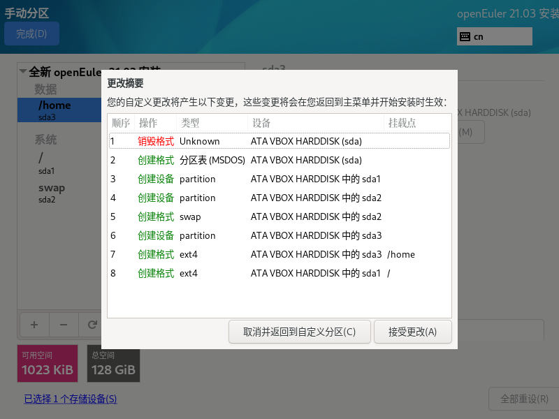

### 2-2. 配置主机名

1. 点击 `网络和主机名`

2. 将 `主机名` 修改为自定义的不含特殊字符的名字 > 点击 `应用` > `完成`：

   

### 2-3. 选择安装软件

1. 点击 `软件选择`

2. 保持 `最小安装` 不变 > 勾选 `标准安装` 和 `系统工具` > 点击 `完成`：

   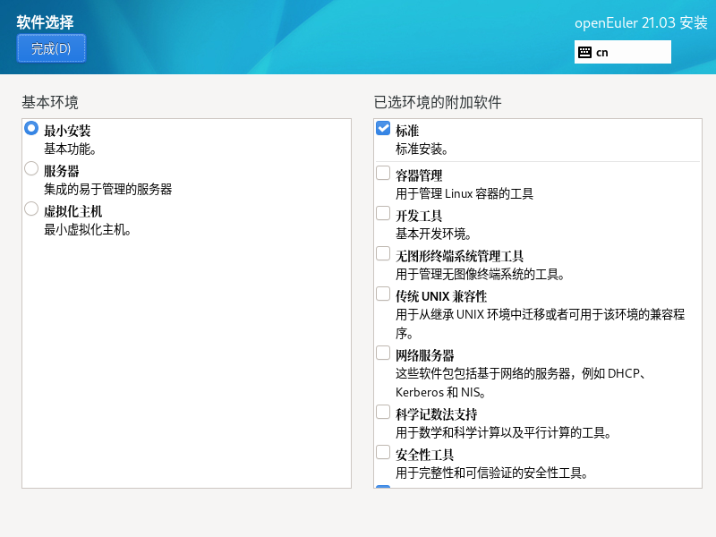

   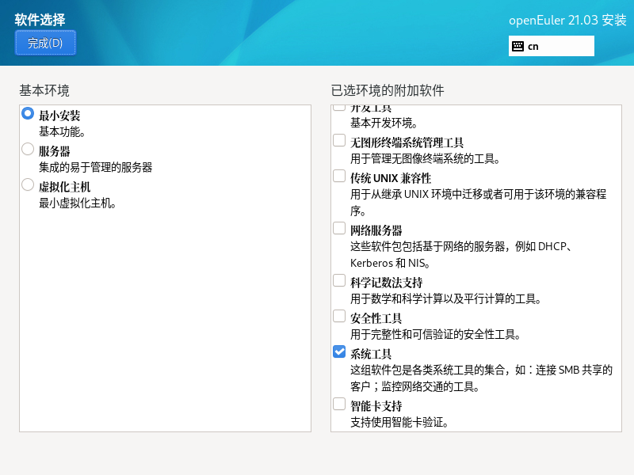

   ::: tip ℹ️ 提示

   可根据实际情况安装其它组件。

   :::

### 2-4. 配置 root 用户密码

1. 点击 `根密码`

2. 输入两次 root 用户密码 > 点击 `完成`：

   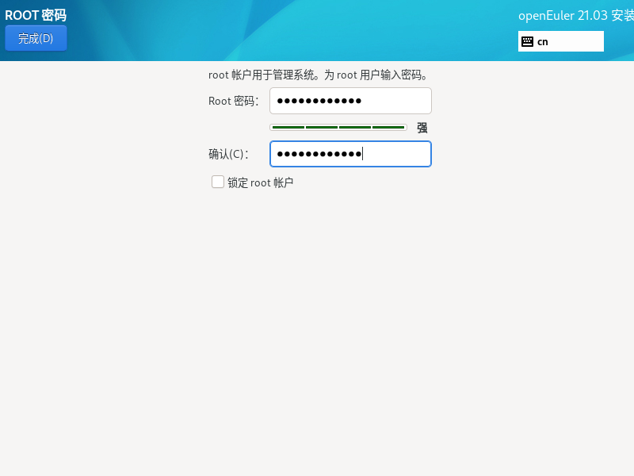

   ::: tip ℹ️ 提示

   用户设置的 root 用户密码或新创建用户的密码均需要满足密码复杂度要求，否则会导致密码设置或用户创建失败。设置密码的复杂度的要求如下：

   - 口令长度至少 8 个字符
   - 口令至少包含大写字母、小写字母、数字和特殊字符中的任意 3 种
   - 口令不能和账号一样
   - 口令不能使用字典词汇

   :::

### 2-5. 创建管理员账户

1. 点击 `创建用户`

2. 输入 `全名`、`用户名`、`密码` > 勾选 `将此用户设为管理员` > 点击 `完成`：

   

   ::: tip ℹ️ 提示

   勾选 `将此用户设为管理员` 后系统会将其加入 `wheel` 用户组，使其可用 `sudo` 提权。

   :::

::: tip ℹ️ 提示

其它配置项保持默认即可，也可根据实际情况自行调整。

:::

## 3. 开始安装系统

1. 点击 `开始安装`：

   

2. 随后会正式开始安装 openEuler：

   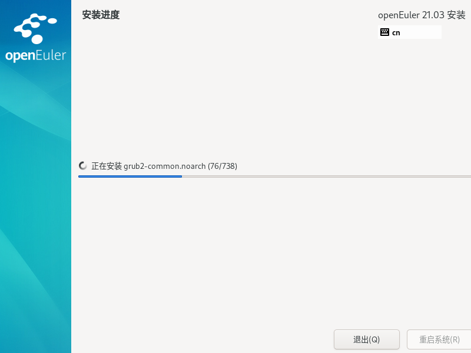

   ::: tip ℹ️ 提示

   此过程等待时间将根据机身性能不同而不同，请耐心等待（不妨去喝杯 ☕️ 咖啡）。

   :::

## 4. 完成安装

1. 点击 `重启系统`：

   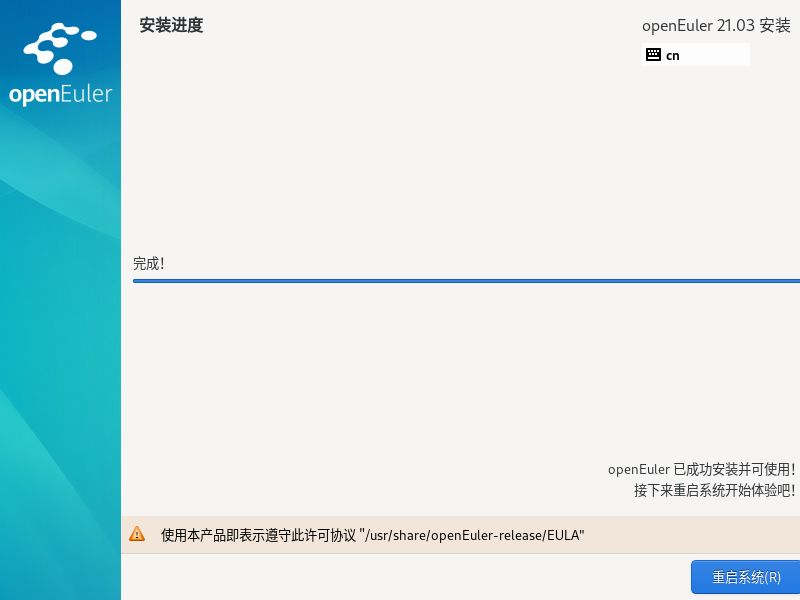

   ::: tip ℹ️ 提示

   物理机需要移除安装 U 盘、虚拟机需要移除虚拟盘，否则还会进入安装界面而不是进入安装好的系统。

   :::

2. 进入系统后输入用户名、密码，登录系统：

   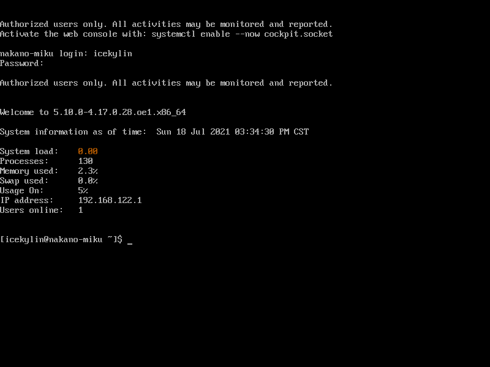

   ::: tip ℹ️ 提示

   输入密码时**不会**有任何显示，不要以为键盘坏了！

   :::

3. 输入以下命令查看系统信息：

   ```sh
   cat /etc/os-release
   ```

   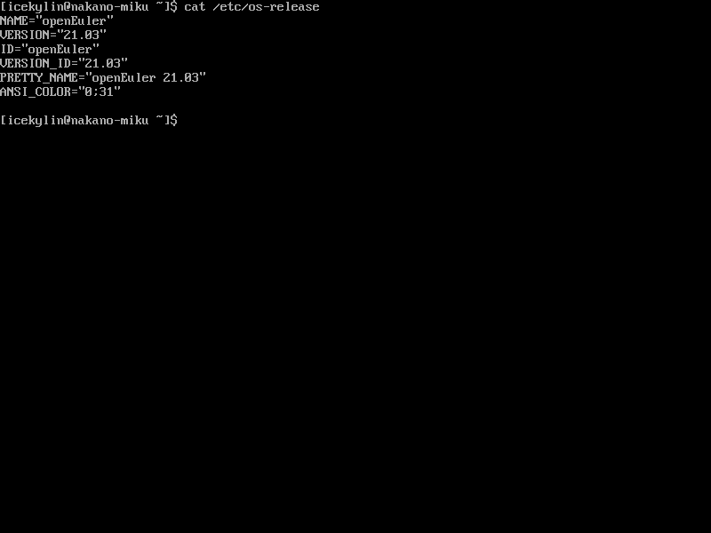

## 🎉 祝贺！

到此为止，一个基础的、无图形界面的 openEuler 已经安装完成了！在下一节我们将安装图形界面。

::: tip ℹ️ 提示

你可以使用以下命令关机：

```sh
shutdown -h now
```

:::
