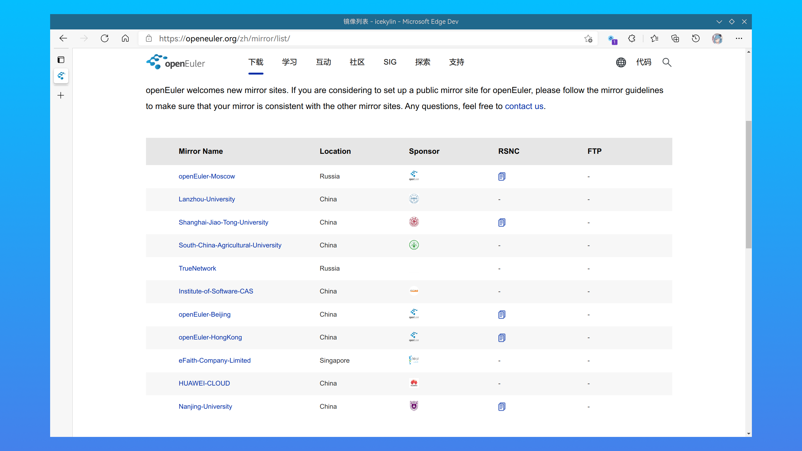
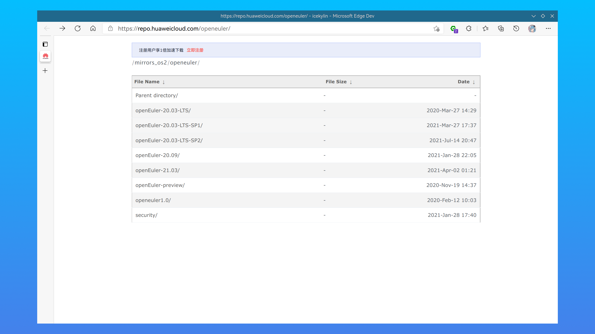
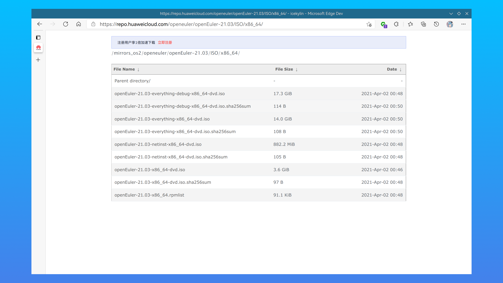
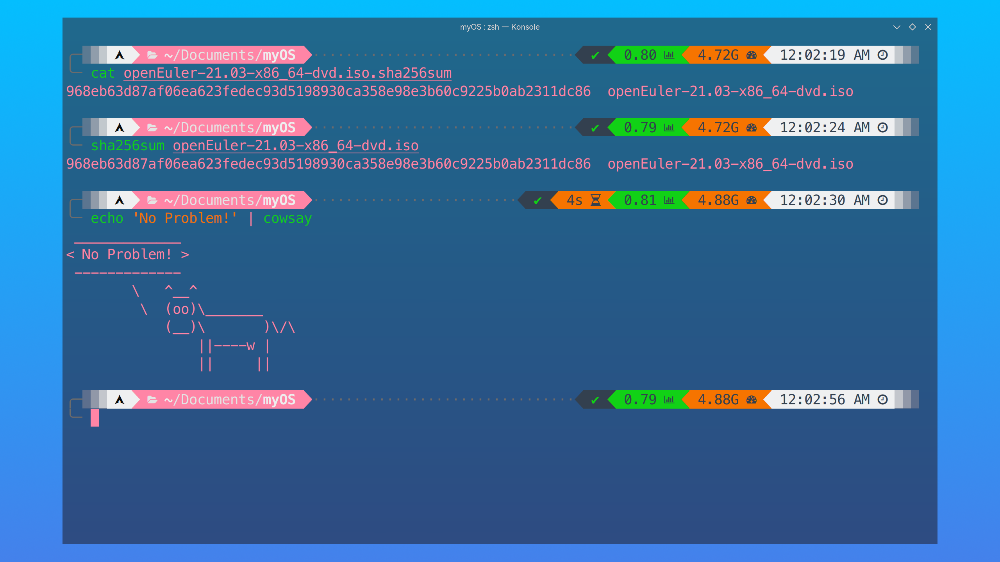
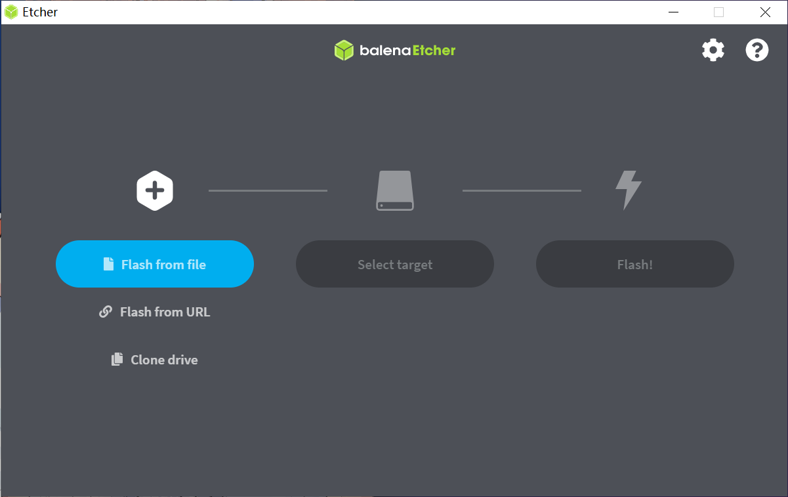
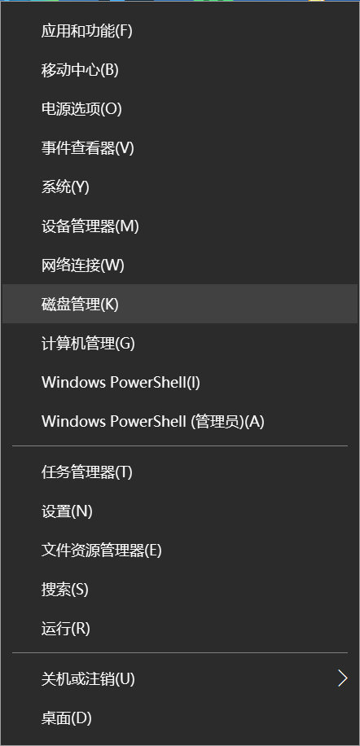
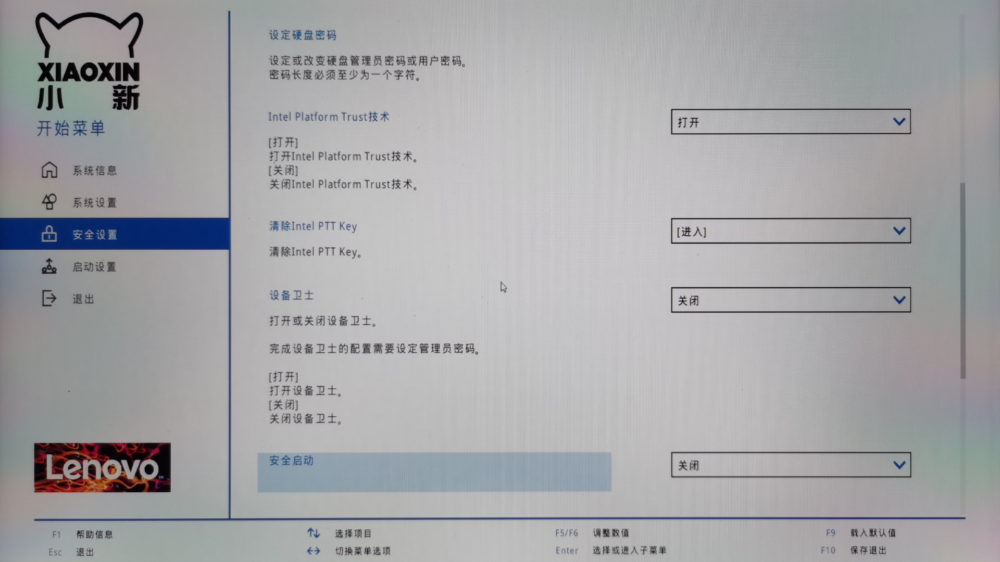
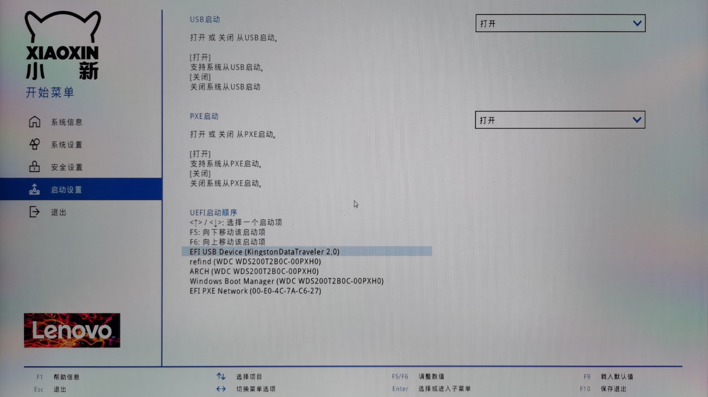

# 安装前的准备

> ### 🧭 凡事预则立，不预则废
>
> 这一章开始，我们正式开始安装 openEuler。但是我们首先要做一些准备工作。

> ### 🔖 这一节将会讨论：
>
> ::: details 目录
>
> [[toc]]
>
> :::

::: tip ℹ️ 提示

由于当前 UEFI 已普及十余年，（除了虚拟机）安装将全部以 `UEFI + GPT` 的形式进行，传统 `BIOS` 方式不再赘述。

:::

## 1. 下载安装镜像

1. 打开 [openEuler 镜像列表](https://openeuler.org/zh/mirror/list/) > 选择一个合适的镜像源（一般来说地理位置越近下载速度越快，此处以 [华为云](https://repo.huaweicloud.com/openeuler/) 为例）：

   

2. 选择合适版本，此处以 openEuler 21.03 为例：

   

3. 依次进入 `ISO` > `x86_64` > 点击相关文件以将安装镜像 `openEuler-21.03-aarch64-dvd.iso` 和校验文件 `openEuler-21.03-aarch64-dvd.iso.sha256sum` 下载到本地：

   

4. 在下载位置打开终端，进行安装镜像完整性校验（可选）：

   1. 使用以下命令依次查看校验文件中的 sha256 校验值：

   :::: code-group
   ::: code-group-item UNIX like

   ```sh
   cat openEuler-21.03-x86_64-dvd.iso.sha256sum
   ```

   :::
   ::: code-group-item Windows

   ```bat
   type openEuler-21.03-x86_64-dvd.iso.sha256sum
   ```

   :::
   ::::

   2. 计算安装镜像的 sha256 校验值：

   :::: code-group
   ::: code-group-item UNIX like

   ```sh
   sha256sum openEuler-21.03-x86_64-dvd.iso
   ```

   :::
   ::: code-group-item Windows

   ```bat
   certutil -hashfile openEuler-21.03-x86_64-dvd.iso SHA256
   ```

   :::
   ::::

   3. 检查两者是否一致。若不一致，请尝试重新下载安装镜像或检查镜像源可信度

   

## 2. 刻录安装 U 盘

准备一个 8G 以上的 U 盘，刻录一个安装盘。

### 2-1. Windows

Windows 下推荐使用 [Ventoy](https://www.ventoy.net/cn/doc_start.html)、[Rufus](https://rufus.ie/) 或者 [Power ISO](https://www.poweriso.com/download.php)<sup>EULA</sup> 进行 U 盘刻录。三者皆为免费使用的软件。具体操作请自行查阅，都非常简单。

除此之外，如果你还嫌麻烦，还可以使用更为简单的安装盘制作工具 [balenaEtcher](https://www.balena.io/etcher/)：



::: tip ℹ️ 提示

使用 balenaEtcher 制作完成的安装盘若要重新作为普通 U 盘使用，需要用磁盘分区管理工具（如 [KDE 分区管理器](https://apps.kde.org/partitionmanager/)、[DiskGenius](https://www.diskgenius.cn/)<sup>EULA</sup>）重建分区表才能正常格式化。

:::

### 2-2. Linux

Linux 下同样可以使用 Ventoy 和 balenaEtcher。以 Arch Linux 为例，具体步骤可参阅 [Ventoy（推荐）](https://arch.icekylin.online/advanced/make-install-disk.html#ventoy-推荐) 以及 [balenaEtcher](https://arch.icekylin.online/advanced/make-install-disk.html#balenaetcher)。

也可以直接用 `dd` 命令进行刻录，具体步骤可参阅 [dd 命令](https://arch.icekylin.online/advanced/make-install-disk.html#dd-命令)。

## 3. 为 openEuler 分出硬盘空间（可选）

如果目标是双系统（win10 + openEuler），并且 win10 和 openEuler 将要共存在一个硬盘上的话，往往要在 win10 使用的分区上分出空闲硬盘空间给 openEuler。这里建议**至少分 `128GB` 给 openEuler**。

1. 右键点击 `开始菜单` > 点击 `磁盘管理`：

   

2. 右键点击 `需要压缩的分区` > 点击 `压缩卷`：

   

3. 在 `输入压缩空间量(MB)` 输入需要分给 openEuler 的空闲硬盘空间大小。假设分配 `128GiB` 则输入 `131072`（1GiB = 1024MiB，128GiB = 128 \* 1024MiB = 131072MiB）：

   

4. 点击 `压缩` > 完成之后关闭磁盘管理即可

   ::: warning ⚠️ 注意

   请不要做多余的动作！不要在这里为分出的硬盘空间创建分区！

   :::

## 4. 获取 Bitlocker 恢复密钥

若 win10 分区使用了 🔐 Bitlocker 加密，请提前获取恢复密钥。

关于解锁密钥的查找请参阅 [Mircosoft 相关页面](https://support.microsoft.com/zh-cn/windows/%E5%9C%A8-windows-10-%E4%B8%AD%E6%9F%A5%E6%89%BE-bitlocker-%E6%81%A2%E5%A4%8D%E5%AF%86%E9%92%A5-6b71ad27-0b89-ea08-f143-056f5ab347d6)。

一般来说使用与 win10 相同的微软帐号登录 [aka.ms 相关页面](aka.ms/myrecoverykey) 即可获取。

## 5. 进入主板 BIOS 进行设置

**插入优盘并开机**。在开机的时候，按下 `F2` / `F8` / `F10` / `DEL` 等（取决与你的主板型号，具体请查阅你主板的相关信息）按键，进入主板的 BIOS 设置界面。

除此之外，如果你还嫌麻烦，还可以使用以下方法进入 BIOS：

1. 在 win10 下 按住 `Shift` 键同时点击 `重启`：

   

2. 保持按住 `Shift` 键直到进入如图所示界面：

   

3. 选择 `疑难解答` 并回车 `Enter`

4. 选择 `UEFI 固件设置` 并回车 `Enter`：

   

5. 按下 `Enter` 重启，此时应该已经进入了 BIOS：

   

## 6. 关闭 BIOS 设置中的 Secure Boot

在类似名为 `security`（安全） 的选项卡中，找到一项名为 `Secure Boot`（安全启动，名称可能略有差异）的选项，选择 `Disable` 将其禁用：



## 7. 调整启动方式为 UEFI（可能不需要）

在某些旧的主板里，需要调整启动模式为 `UEFI`，而非传统的 `BIOS/CSM`。在类似名为 `boot` 的选项卡中，找到类似名为 `Boot Mode` 的选项，确保将其调整为 `UEFI only`，而非 `Legacy/CSM`。

## 8. 调整硬盘启动顺序

在类似名为 `boot` 的选项卡中，找到类似名为 `Boot Options`（名称可能略有差异）的设置选项，将优盘的启动顺序调至首位：




## 9. 保存 BIOS 设置

最后保存 BIOS 设置并退出，一般的按键是 `F10`：


## 10. 准备安装

此时电脑重启，不出意外的话根据提示你应该可以顺利进入 openEuler 的安装界面了：


::: tip ℹ️ 提示

openEuler 安装盘应该一直插在 🖥️ 电脑上

:::
