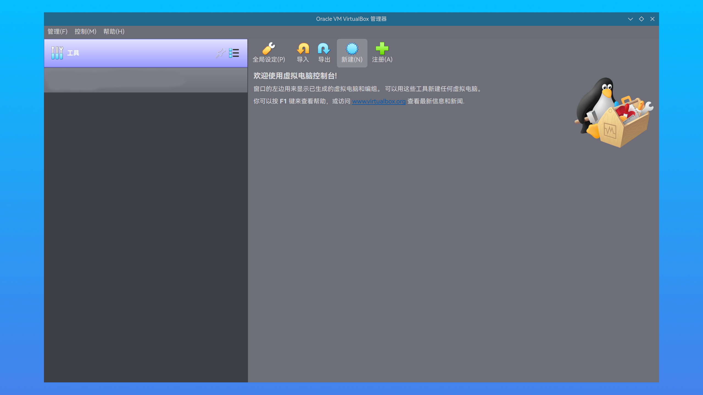
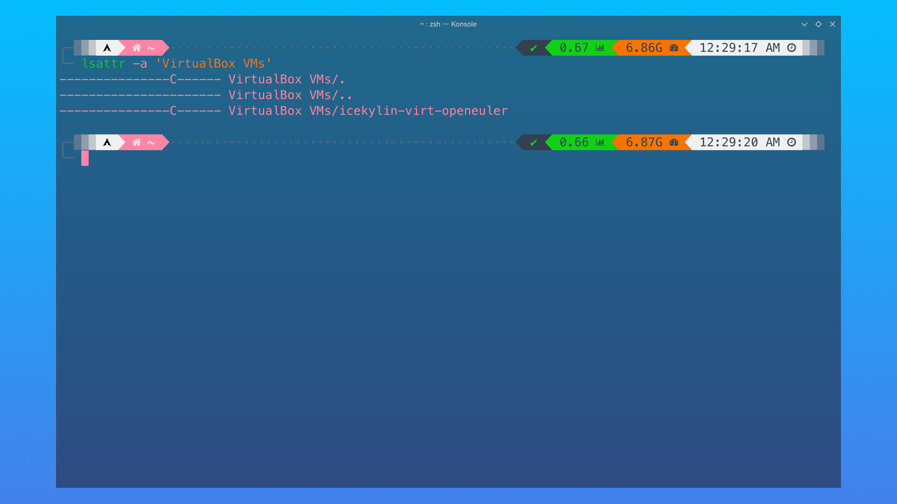
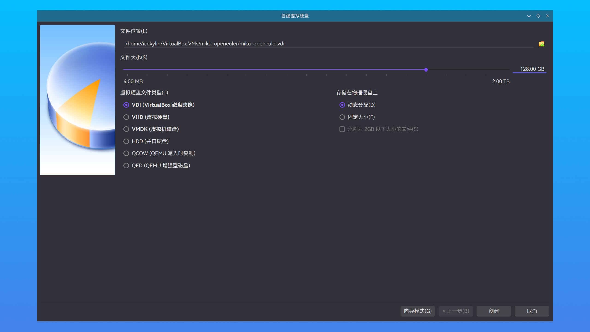
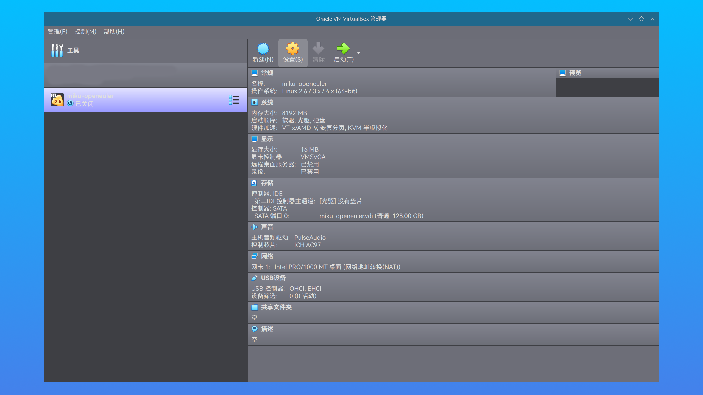
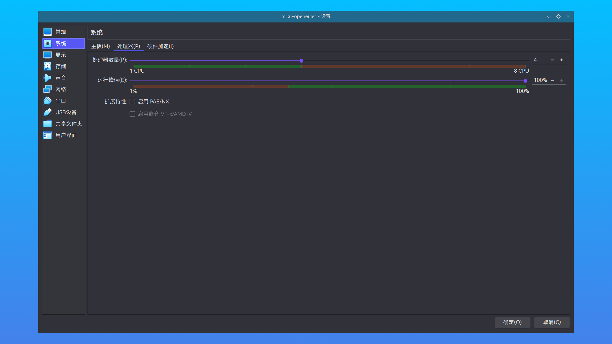
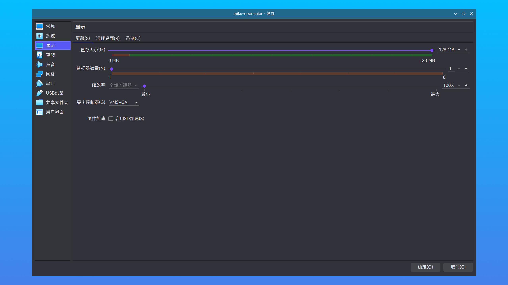
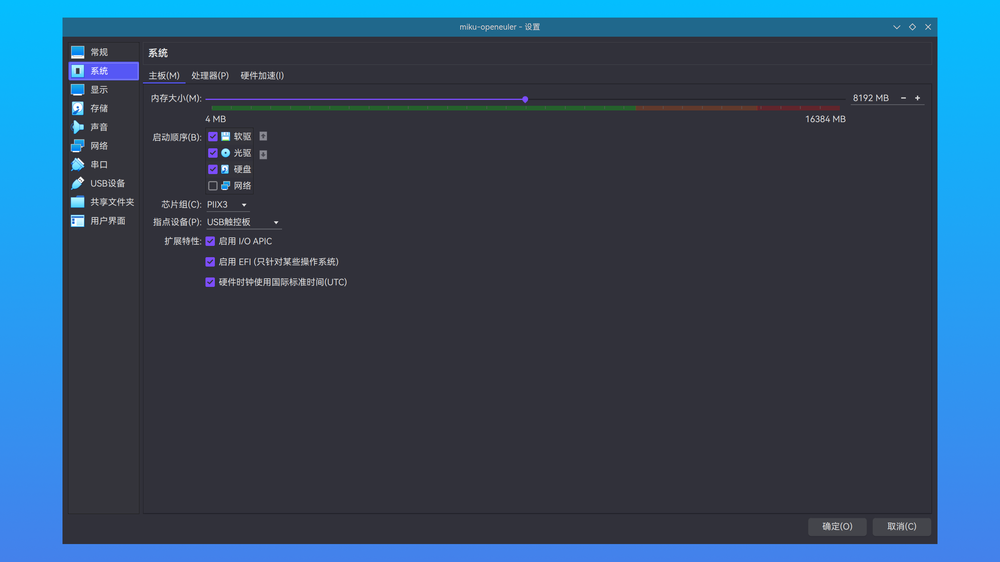
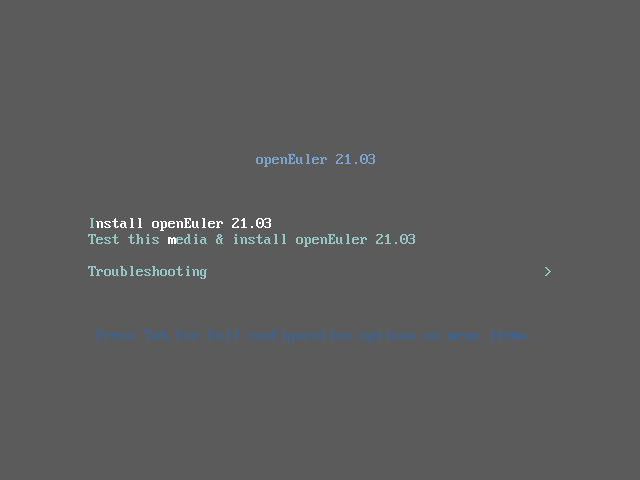

# 虚拟机安装前的准备

> ### ✔ 磨刀不误砍柴工
>
> 在物理机安装 openEuler 前，不妨先在虚拟机中尝试一下 openEuler 的安装。同样的，我们需要先做一些设置。

> ### 🔖 这一节将会讨论：
>
> ::: details 目录
>
> [[toc]]
>
> :::

本指南将使用 [Oracle VM VirtualBox](https://www.virtualbox.org/) 虚拟机安装 openEuler。

> #### 📑 相关资料：VirtualBox
>
> VirtualBox 是一款开源虚拟机软件。由德国 Innotek 公司开发，Sun Microsystems 公司出品。使用 Qt 编写，在 Sun 被 Oracle 收购后正式更名成 Oracle VM VirtualBox。采用 GPL 协议开源。

## 1. 安装 VirtualBox

根据操作系统的不同，请选择合适的方法安装 Oracle VM VirtualBox。

### Windows & macOS

1. 下载安装包：

   Windows 和 macOS 的最新安装包可以在开源镜像站（推荐）或者 [VirtualBox 官方下载页面](https://www.virtualbox.org/wiki/Downloads) 下载。

   下面是国内常用的提供 VirtualBox 安装包的开源镜像站（选一个即可）：

   - [清华大学开源软件镜像站](https://mirrors.tuna.tsinghua.edu.cn/help/virtualbox/)

   - [哈尔滨工业大学开源镜像站](https://mirrors.hit.edu.cn/virtualbox/)

2. 类似安装其它的软件，按照提示安装即可

### Linux

#### Arch Linux

1. 通过 Pacman 包管理器安装 [VirtualBox](https://archlinux.org/packages/community/x86_64/virtualbox/)。若使用 [`linux`](https://archlinux.org/packages/core/x86_64/linux/) 内核，需要安装 [`virtualbox-host-modules-arch`](https://archlinux.org/packages/community/x86_64/virtualbox-host-modules-arch/)；若使用了其它 Arch 官方支持的内核，则需要安装 [`virtualbox-host-dkms`](https://archlinux.org/packages/community/x86_64/virtualbox-host-dkms/)：

   :::: code-group
   ::: code-group-item linux

   ```sh
   sudo pacman -S virtualbox virtualbox-host-modules-arch
   ```

   :::
   ::: code-group-item others

   ```sh
   sudo pacman -S virtualbox virtualbox-host-dkms
   ```

   :::
   ::::

2. 重启计算机以加载 VirtualBox 的四个内核模块

#### Debian 系发行版

1. 添加 Oracle VirtualBox 仓库的 GPG 密钥：

   :::: code-group
   ::: code-group-item Debian 8 和 Ubuntu 16.04 及以上

   ```sh
   wget -q https://www.virtualbox.org/download/oracle_vbox_2016.asc -O- | sudo apt-key add -
   ```

   :::
   ::: code-group-item 其它版本

   ```sh
   wget -q https://www.virtualbox.org/download/oracle_vbox.asc -O- | sudo apt-key add -
   ```

   :::
   ::::

2. 将 Oracle VirtualBox 仓库添加到仓库列表中：

   ```sh
   sudo add-apt-repository "deb [arch=amd64] http://download.virtualbox.org/virtualbox/debian $(lsb_release -cs) contrib"
   ```

   ::: tip ℹ️ 提示

   Ubuntu 之外的用户需要根据自身的发行版，替换 `$(lsb_release -cs)` 为对应的系统代号。

   如 `bionic`、`xenial`、`buster`、`stretch` 或 `jessie`。

   :::

3. 刷新缓存并安装 VirtualBox 即可：

   ```sh
   sudo apt update && sudo apt install virtualbox-x.x # 通过 Tab 键补全查看最新可用版本
   ```

#### RPM 系发行版

1. 创建并编辑 `virtualbox.repo` 文件：

   ```sh
   sudoedit /etc/yum.repos.d/virtualbox.repo
   ```

   添加以下内容：

   :::: code-group
   ::: code-group-item Oracle Linux / RHEL

   ```repo
   [virtualbox]
   name=Oracle Linux / RHEL / CentOS-$releasever / $basearch - VirtualBox
   baseurl=http://download.virtualbox.org/virtualbox/rpm/el/$releasever/$basearch
   enabled=1
   gpgcheck=1
   repo_gpgcheck=1
   gpgkey=https://www.virtualbox.org/download/oracle_vbox.asc
   ```

   :::
   ::: code-group-item Fedora

   ```repo
   [virtualbox]
   name=Fedora $releasever - $basearch - VirtualBox
   baseurl=http://download.virtualbox.org/virtualbox/rpm/fedora/$releasever/$basearch
   enabled=1
   gpgcheck=1
   repo_gpgcheck=1
   gpgkey=https://www.virtualbox.org/download/oracle_vbox.asc
   ```

   :::
   ::: code-group-item openSUSE

   ```repo
   [virtualbox]
   name=VirtualBox for openSUSE $releasever - $basearch
   baseurl=http://download.virtualbox.org/virtualbox/rpm/opensuse/$releasever/$basearch
   type=yum
   enabled=1
   priority=120
   autorefresh=1
   gpgcheck=1
   gpgkey=https://www.virtualbox.org/download/oracle_vbox.asc
   keeppackages=0
   ```

   :::
   ::::

2. 刷新缓存并安装 VirtualBox 即可：

   ```sh
   sudo yum makecache && sudo yum install VirtualBox-x.x # 通过 Tab 键补全查看最新可用版本
   ```

## 2. 下载安装镜像

参考 [安装前的准备](./pre-install.md#_1-下载安装镜像) 下载 openEuler 安装镜像。

## 3. 配置 VirtualBox

1. 打开 VirtualBox > 点击 `新建`：

   

2. 在弹出的设置向导窗口中进行如下设置 > 点击 `创建`：

   

   - 输入虚拟机的名字以及虚拟机相关文件的保存位置：

   ::: tip ℹ️ 提示

   不要在名字中带有特殊字符。

   :::

   ::: warning ⚠️ 注意

   若使用 Btrfs 文件系统，请确保在创建虚拟机**之前**，虚拟机相关文件的保存位置关闭了 [写时复制](https://btrfs.wiki.kernel.org/index.php/SysadminGuide#Copy_on_Write_.28CoW.29)（CoW），否则会导致严重的性能问题。

   1. 使用 `lsattr` 命令查看目录是否带有 `C` 标志：

      ```sh
      lsattr -a /path/to/VirtualBox VMs
      ```

      

   2. 若没有 `C` 标志，使用以下命令添加：

      ```sh
      sudo chattr +C /path/to/VirtualBox VMs
      lsattr -a /path/to/VirtualBox VMs # 复查一下
      ```

   :::

   - 将内存大小修改为合适大小：

   ::: tip ℹ️ 提示

   至少需要 `4GB`。但为了获得更好的应用体验，建议不小于 `8GB`。

   :::

3. 继续完成以下配置 > 点击 `创建`：

   

   - `文件位置` 一般保持默认即可
   - 调整 `文件大小`

   ::: tip ℹ️ 提示

   至少需要 `16GB`。但为了获得更好的应用体验，建议不小于 `128GB`。由于选择 `动态分配`，所以不会立即占用磁盘空间，请放心调整此大小。

   :::

   - 选择 `VDI` 类型（默认）
   - 选择 `动态分配`（默认）

   ::: tip ℹ️ 提示

   设置向导完成后，请**不要**立即启动。

   :::

4. 点击 `设置`：

   

5. 在设置界面中调整其它选项 > 点击 `确定`：

   - 点击侧边栏 `系统` > 选项卡 `处理器` > 将 `处理器数量` 更改为合适大小（`4`）:

   

   - 点击侧边栏 `显示` > 选项卡 `屏幕` > 将 `显存大小` 更改为合适大小（`128MB`）:

   

   - 点击侧边栏 `网络` > 选项卡 `网卡 1` > 将 `连接方式` 更改为 `桥接网卡`:

   

   - 点击侧边栏 `系统` > 选项卡 `主板` > 勾选 `启用 EFI（只针对某些操作系统）`:

   

   ::: tip ℹ️ 提示

   勾选此选项是因为 GPT + UEFI 目前已是主流安装方式。但若因此导致黑屏而无法正常进入安装界面请将此选项关掉。

   :::

## 4. 尝试进入安装界面

1. 点击 `启动`，开启虚拟机

2. 在弹出的选择启动盘窗口依次进行以下操作，挂载安装镜像：

   - 点击 `文件夹小图标`

   - 点击 `注册` > 在弹出的资源管理器中选择 `openEuler-21.03-x86_64-dvd.iso`

   - 选中 `openEuler-21.03-x86_64-dvd.iso` > 点击 `选择`

3. 通过方向键 `⬆️` / `⬇️` 控制选项，在第一个选项回车 `Enter`：

   

4. 经过一段时间的等待，即可看到图形化的安装界面：

   

至此，在虚拟机中安装 openEuler 的准备工作已经完成。请参阅下一节 [openEuler 基础安装](./basic-install.md) 进行安装。
